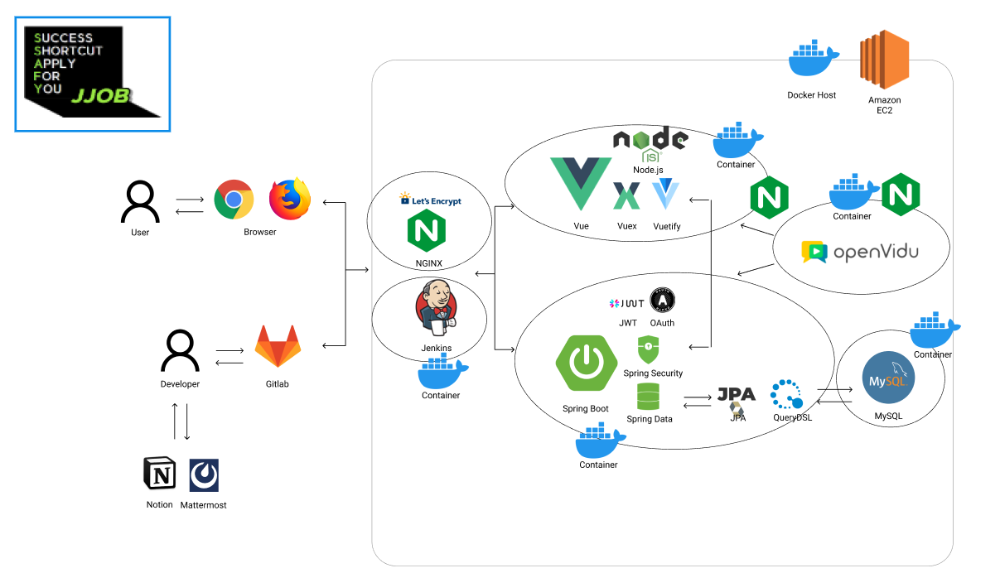

# 🧠 brAIn

## 💡 개요

### ✍🏻 기획 배경: 
- 아이디어 도출 회의에서 생성형 AI를 활용하는 방식은 새로운 가능성을 열어주었지만, 회의 중 AI에게 질문을 던지는 과정에서 회의의 흐름이 끊기고, 참여자들의 집중력이 분산되는 문제가 발생했습니다. 이로 인해 아이디어 도출의 효율성도 저하되는 상황이 빈번하게 나타났습니다.

- 또한, 처음 참여하는 사람들 또는 낯선 상황에 처한 사람들이 낯을 가리는 경우도 종종 발생합니다. 이러한 경우, 아이디어 도출이 원활히 이루어지지 않거나, 참여자들이 자신의 의견을 자유롭게 표현하지 못할 수 있습니다.

- 이러한 문제들을 해결하기 위해 AI를 회의에 직접 참여시키고, 실시간으로 아이디어를 제공하며 논의를 촉진하는 역할을 맡기는 방식을 도입하고자 합니다. AI가 팀의 일원으로서 실시간 협업을 강화함으로써, 회의의 집중도와 효율성을 높이고, 낯을 가리는 참여자들도 보다 편안하게 의견을 나눌 수 있는 환경을 조성하는 새로운 접근 방식이 필요합니다.

### 📛 서비스명 : ***brAIn***

### 🏅 목표:
 - 창의적인 아이디어 도출: 브레인스토밍 과정에서 창의적이고 다채로운 아이디어를 도출하는 것을 목표로 합니다.
 - AI와 인간의 협업: AI와 인간이 협력하여 더 나은 아이디어를 만들어내는 새로운 형태의 브레인스토밍을 추구합니다. 
 - 라운드 로빈 기법 적용: 모든 참여자가 고르게 참여하도록 하여 자유롭게 다양한 아이디어를 도출하고 의견을 공유합니다.


## ⭐ 멤버
<table>
 <tr>
    <td align="center"><a href="https://github.com/sooooori"></a></td>
    <td align="center"><a href="https://github.com/ChaMinHyeuk"></a></td>
    <td align="center"><a href="https://github.com/ssafy11"></a></td>
    <td align="center"><a href="https://github.com/Do1K"></a></td>
    <td align="center"><a href="https://github.com/kw99j10"></a></td>
    <td align="center"></a></td>
  </tr>
  <tr>
    <td align="center"><b>프론트엔드</b></a></td>
    <td align="center"><b>프론트엔드</b></a></td>
    <td align="center"><b>백엔드</b></a></td>
    <td align="center"><b>백엔드</b></a></td>
    <td align="center"><b>백엔드 & 인프라</b></a></td>
    <td align="center"><b>백엔드 & AI</b></a></td>
  </tr>
  <tr>
    <td align="center"><a href="https://github.com/sooooori"><b>김상수</b></a></td>
    <td align="center"><a href="https://github.com/ChaMinHyeuk"><b>차민혁</b></a></td>
    <td align="center"><a href="https://github.com/ssafy11"><b>김호준</b></a></td>
    <td align="center"><a href="https://github.com/Do1K"><b>강도원</b></a></td>
    <td align="center"><a href="https://github.com/kw99j10"><b>정경원</b></a></td>
    <td align="center"><a href="https://github.com/bardisue"><b>박병준</b></a></td>
  </tr>
</table>


## 👋 서비스 소개

### 페르소나
 + 페르소나 추가 예정

### 기대 효과
 - 효율적인 브레인스토밍: AI의 참여로 회의의 흐름이 끊기지 않고 지속적으로 유지되며, 보다 많은 창의적 아이디어가 도출될 수 있습니다.
 - 창의력 향상: AI가 제공하는 다양한 관점과 인간의 창의력이 결합되어 팀의 전체적인 창의력이 향상됩니다.
 - 집중도 유지: AI가 브레인스토밍의 진행을 도와주어 참여자들이 집중력을 잃지 않고 지속적으로 아이디어를 공유할 수 있습니다.


## 📺 서비스 화면
- 추가예정


## 🦾 주요 기능

- 추가예정


## 💻 기술스택

### Frontend
+  
+  
+  
+ 
+ 


### Backend
+ 
+ 
+ 
+ 
+ 
+ 
+ 
+ 
+ 


### DB & AI
+ 
+ 
+  


### INFRA
+ 
+ 
+ 
+ 
+ 


### CI/CD
+ 
+ 
+ 

### SUPPORT TOOL
+ 
+ 
+ 
+ 
+ 
+ 

<br>

## 🧬 프로젝트 구조 

### 아키텍처 다이어그램




### Server

```plaintext
brAIn/
├── ai/
│   ├── config/
│   ├── response/
│   └── service/
├── auth/
│   ├── config/
│   ├── jwt/
│   └── oauth/
│       ├── google/
│       │   ├── controller/
│       │   └── service/
│       └── kakao/
│           ├── controller/
│           ├── dto/
│           └── service/
├── comment/
│   ├── controller/
│   ├── dto/
│   ├── entity/
│   ├── repository/
│   └── service/
├── conferenceroom/
│   ├── controller/
│   ├── dto/
│   ├── entity/
│   └── repository/
├── config/
├── exception/
├── history/
│   ├── controller/
│   ├── dto/
│   ├── entity/
│   ├── repository/
│   └── service/
├── member/
│   ├── controller/
│   ├── dto/
│   ├── entity/
│   └── repository/
├── openai/
│   └── service/
├── openvidu/
│   ├── controller/
│   └── service/
├── postit/
│   ├── controller/
│   ├── entity/
│   └── repository/
├── roundboard/
│   ├── entity/
│   └── repository/
├── roundpostit/
│   ├── entity/
│   └── repository/
├── s3/
├── stomp/
│   ├── config/
│   ├── controller/
│   ├── dto/
│   ├── request/
│   ├── response/
│   └── service/
├── util/
└── vote/
    ├── controller/
    ├── dto/
    ├── entity/
    └── repository/
```


### Client 

```plaintext
src/
├── actions/
├── assets/
│   └── svgs/
├── components/
│   ├── Button/
│   ├── Navbar/
│   ├── save/
│   └── SmallButton/
├── features/
│   ├── auth/
│   ├── conference/
│   └── note/
├── hooks/
├── pages/
│   ├── Conference/
│   │   └── components/
│   ├── Home/
│   │   └── components/
│   ├── Profile/
│   │   └── components/
│   └── User/
│       └── components/
├── reducers/
└── utils/
```
