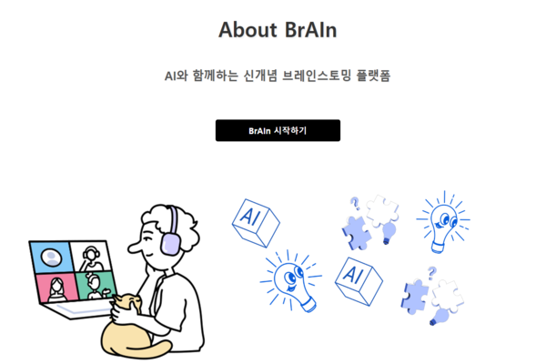
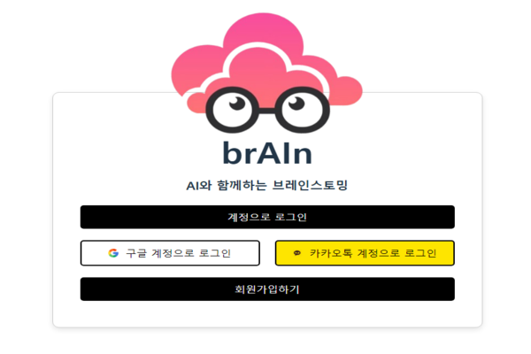
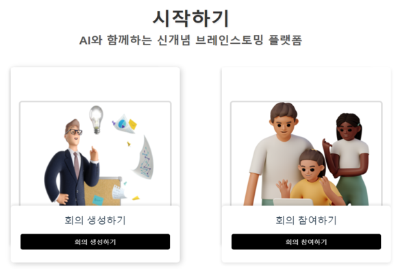
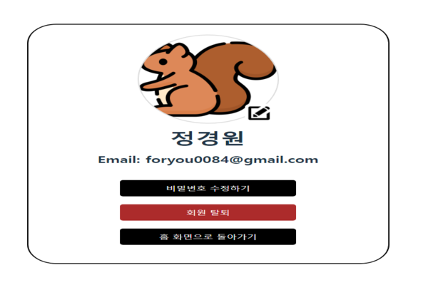
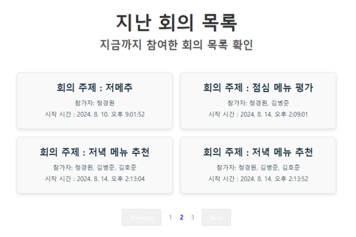
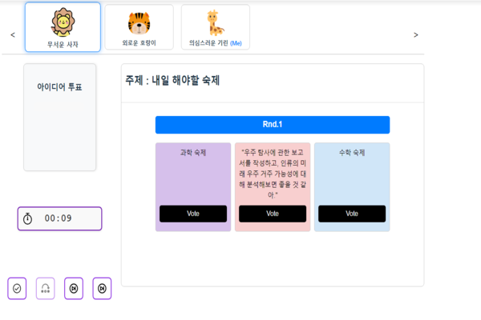
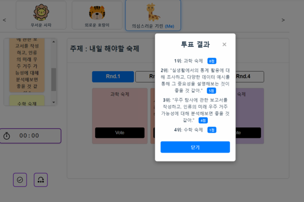
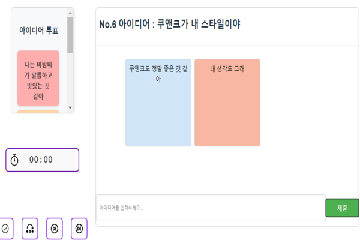
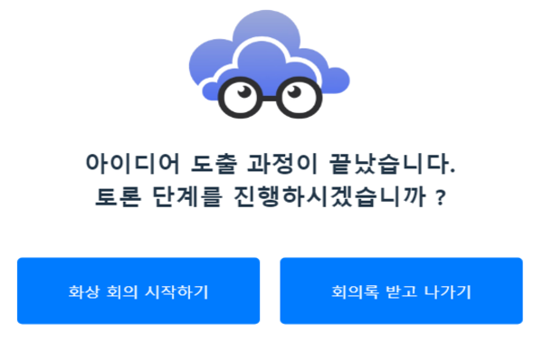
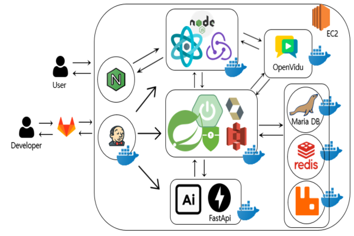

# 🧠 brAIn

## 💡 개요

### ✍🏻 기획 배경: 

- 기존 아이디어 도출 회의에서 생성형 AI를 활용하는 시도는 그 자체로 혁신적이었으나, AI에게 질문을 던지며 발생하는 흐름의 단절과 참여자의 집중력 저하 문제는 중요한 도전 과제로 남아 있었습니다. 이는 AI가 회의 도중 단순 도구로 사용될 때 발생하는 문제점이며, 참여자들이 AI의 역할을 제대로 활용하지 못할 경우 더욱 두드러졌습니다.

- 또한, 회의에 처음 참여하는 사람들, 특히 낯선 환경이나 새로운 사람들과 함께할 때 긴장감으로 인해 자신의 의견을 자유롭게 표현하지 못하는 경우가 종종 발생했습니다. 이는 회의의 효율성을 저하시키고, 창의적인 아이디어 도출의 기회를 놓치는 결과로 이어질 수 있습니다.

- 이러한 문제들을 해결하기 위해 AI를 회의에 직접 참여시키고, 실시간으로 아이디어를 제공하며 논의를 촉진하는 역할을 맡기는 방식을 도입하고자 합니다. AI가 팀의 일원으로서 실시간 협업을 강화함으로써, 회의의 집중도와 효율성을 높이고, 참여자들이 자유롭고 편안하게 아이디어를 공유할 수 있는 환경을 조성하고자 합니다.


### 📛 서비스명 : ***brAIn***

### 🏅 목표:

- 창의적인 아이디어 도출: 라운드 로빈 기법을 적용하여 모든 참여자가 골고루 의견을 공유할 수 있도록 장려하며, 이를 통해 더 창의적이고 다양한 아이디어를 도출합니다.

- AI와 인간의 협업 강화: AI가 회의의 일원으로서 실시간으로 아이디어를 제공하고, 논의의 방향을 제시하며, 이를 통해 인간 참여자들과의 협업을 극대화합니다.

- 효율적인 회의 운영: AI와 라운드 로빈 기법의 결합으로 회의가 중단 없이 효율적으로 진행될 수 있도록 합니다. 또한, 이러한 방식은 참여자의 집중력을 유지하며 보다 많은 창의적 아이디어를 이끌어내는 데 중점을 둡니다.

---

## ⭐ 멤버
<table>
 <tr>
    <td align="center"><a href="https://github.com/sooooori"></a></td>
    <td align="center"><a href="https://github.com/ChaMinHyeuk"></a></td>
    <td align="center"><a href="https://github.com/ssafy11"></a></td>
    <td align="center"><a href="https://github.com/Do1K"></a></td>
    <td align="center"><a href="https://github.com/kw99j10"></a></td>
    <td align="center"></a></td>
  </tr>
  <tr>
    <td align="center"><b>프론트엔드</b></a></td>
    <td align="center"><b>프론트엔드</b></a></td>
    <td align="center"><b>백엔드</b></a></td>
    <td align="center"><b>백엔드</b></a></td>
    <td align="center"><b>백엔드 & 인프라</b></a></td>
    <td align="center"><b>백엔드 & AI</b></a></td>
  </tr>
  <tr>
    <td align="center"><a href="https://github.com/sooooori"><b>김상수</b></a></td>
    <td align="center"><a href="https://github.com/ChaMinHyeuk"><b>차민혁</b></a></td>
    <td align="center"><a href="https://github.com/ssafy11"><b>김호준</b></a></td>
    <td align="center"><a href="https://github.com/Do1K"><b>강도원</b></a></td>
    <td align="center"><a href="https://github.com/kw99j10"><b>정경원</b></a></td>
    <td align="center"><a href="https://github.com/bardisue"><b>박병준</b></a></td>
  </tr>
</table>


## 👋 서비스 소개

### 😎 페르소나

### **페르소나 1: 50대 팀장 - 김성훈**

**이름**: 김성훈  
**나이**: 52세  
**직업**: 대기업 IT 부서 팀장

### **배경**:

- 25년 이상의 경력을 가진 IT 전문가로, 다양한 프로젝트를 성공적으로 이끌어온 경험이 있음.
- 팀원들과의 나이 차이로 인해 소통에 어려움을 느끼고 있음. 젊은 세대와의 소통 방식에 익숙하지 않아 협업이 원활하지 않을 때가 있음.
- 최근 재택근무가 일반화되면서 팀원들과의 직접적인 대면 소통이 줄어들어, 팀의 결속력 유지와 효율적인 협업에 어려움을 겪고 있음.

### **목표**:

- 팀원 간의 원활한 소통과 협업을 촉진하여 프로젝트의 질을 향상시키고자 함.
- 창의적인 아이디어를 도출하여 프로젝트 성과를 극대화하고, 팀의 경쟁력을 강화하고자 함.
- 모든 팀원들이 적극적으로 회의에 참여하도록 유도하여, 팀 전체의 참여도를 높이고 아이디어 공유를 활발히 하길 원함.

### **고충점**:

- 나이 차이로 인해 팀원들과의 소통이 원활하지 않으며, 이는 협업의 효율성 저하로 이어지고 있음.
- 재택근무 환경에서 팀원들의 회의 참여도가 낮아지고, 회의 중 발언을 꺼리는 팀원들이 있어, 아이디어 도출이 제한적임.
- 일부 팀원들이 회의에서 자신의 의견을 표현하는 것을 어려워하고, 이는 팀의 창의적 잠재력을 충분히 발휘하지 못하게 함.

### **기대하는 기능**:

- **라운드 로빈 기능**: 모든 팀원이 순서대로 발언할 수 있도록 유도하여, 소통 기회를 균등하게 제공하고, 소외되는 팀원이 없도록 함.
- **AI 참가자**: 회의 중 AI가 창의적인 아이디어를 제시하고, 논의를 촉진하여 회의의 활기를 높이며, 다양한 시각을 제공해 줌.
- **익명성 보장**: 팀원들이 민감한 주제나 의견에 대해 자유롭게 발언할 수 있도록 익명성을 보장하여, 솔직하고 다양한 의견을 이끌어냄.

### **프로젝트와의 적합성**:

김성훈 팀장은 프로젝트에서 제안하는 **brAIn**의 기능들이 그의 주요 고충점을 해결해 줄 것으로 기대됨. 특히, 라운드 로빈과 AI 참가자 기능은 그가 원하는 팀원 간의 소통 및 창의적 아이디어 도출을 촉진할 수 있는 핵심 도구가 될 수 있음. 익명성을 보장함으로써 그의 팀원들이 보다 자유롭게 의견을 제시하는 데 큰 도움이 될 것으로 예상됨.


---


### **페르소나 2: 20대 창의적 프로젝트 멤버 - 박지민**

**이름**: 박지민  
**나이**: 21세  
**직업**: 대학생, 디자인 전공

### **배경**:

- 대학 2학년으로, 창의적인 프로젝트와 토론을 즐기는 학생.
- 다양한 아이디어를 통해 프로젝트 주제를 정하고 발전시키는 데 열정적임.
- 온라인 협업 도구를 자주 사용하며, 여러 가지 툴에 익숙함.

### **목표**:

- 팀원들과의 협업을 통해 창의적이고 독창적인 프로젝트 주제를 빠르게 설정하고 발전시키고자 함.
- 새로운 아이디어를 다양하게 탐색하고 발전시키는 과정에서 적극적으로 참여함.
- 온라인 환경에서도 활발한 의견 교환과 브레인스토밍을 실현하고자 함.

### **고충점**:

- 일부 팀원들이 소극적으로 참여하여 아이디어가 제한되는 경우가 있음.
- 회의가 지루해지면 창의성이 떨어져 회의의 질이 저하됨.
- 온라인 회의에서 실시간으로 아이디어를 시각화하고 발전시키는 데 어려움을 겪음.

### **기대하는 기능**:

- **라운드 로빈 기능**: 모든 팀원이 순서대로 발언하도록 하여, 다양한 아이디어를 끌어내고 브레인스토밍을 활성화함.
- **AI 참가자**: 창의적 발상을 돕고, 새로운 관점을 제시하는 AI. 예를 들어, 아이디어를 조합하거나 예상치 못한 질문을 던져 팀의 사고를 확장시킴.
- **실시간 아이디어 보드**: 실시간으로 아이디어를 시각적으로 정리하고 공유할 수 있는 기능, 팀원들이 동시에 작업할 수 있는 공간 제공.
- **발언 타이머**: 발언 시간을 한정지어 회의 시간을 효율적으로 관리하고, 창의적인 아이디어 도출을 촉진함.

### **프로젝트와의 적합성**:

박지민은 **brAIn** 프로젝트에서 제공하는 기능들이 그의 목표와 고충점을 해결하는 데 매우 유용할 것으로 기대됨. 특히, 라운드 로빈 기능과 실시간 아이디어 보드는 박지민이 온라인 환경에서도 활발히 참여하고, 창의적인 아이디어를 발전시키는 데 중요한 역할을 할 수 있음. AI 참가자는 박지민이 선호하는 창의적 사고를 자극하고, 새로운 관점을 제공하는 데 도움이 될 것임.


---


## ✨ 기대 효과

- 효율적인 브레인스토밍: AI의 실시간 참여로 회의 흐름이 중단되지 않고 지속되며, 다양한 아이디어가 끊임없이 도출됩니다. AI는 필요한 순간에 적절한 아이디어를 제공함으로써 회의의 진행을 촉진합니다.

- 창의력 증대: AI가 제공하는 다양한 관점과 인간의 창의력이 결합되어 팀 전체의 창의력이 향상됩니다. AI는 새로운 시각에서의 아이디어를 제공하며, 이는 인간 참여자의 사고를 자극하여 더 독창적인 결과를 도출하게 합니다.

- 집중력 유지: AI가 회의를 진행하면서 주요 논점을 요약하거나, 논의가 필요한 주제를 제시함으로써 참여자들의 집중력을 유지합니다. 이를 통해 회의의 질을 높이고, 보다 많은 의견이 효율적으로 공유될 수 있는 환경을 제공합니다.

- 자유롭고 편안한 참여 환경 조성: 익명성이 보장되는 환경에서 AI가 회의의 일원으로 참여함으로써, 참여자들이 심리적 부담 없이 자유롭게 의견을 표현할 수 있습니다. 이는 특히 새로운 참여자나 낯선 환경에서 중요한 역할을 합니다.


---


## 🦾 주요 기능

### 익명성을 보장하는 회의 진행
- 참가자들은 가명을 사용하여 익명으로 소통하며, 아이디어의 질과 양을 높이는 데 중점을 둡니다.
이를 통해 민감한 주제나 개인적 우려로 인해 제시하기 어려운 의견도 자유롭게 제시할 수 있습니다.
- 라운드 로빈 방법을 이용한 회의 진행
모든 참가자는 정해진 순서에 따라 발언 기회를 가지며, 자신의 순서가 되면 반드시 아이디어를 제시해야 합니다.
- 시스템이 발언 순서를 자동으로 관리하여, 모든 참가자가 한 번 이상 발언할 수 있도록 보장합니다.

### 실시간 공동 아이디어 보드 사용 및 투표
- 모든 참가자가 실시간으로 아이디어를 시각적으로 공유하고 함께 작업할 수 있는 공용 작업 보드를 제공합니다.
- 참가자들은 다른 사람의 의견을 실시간으로 확인하고, 보드에 직접 추가하거나 수정할 수 있어 협업의 효율성을 극대화할 수 있습니다.

### 회의 종료 후 요약본 즉시 확인
- 회의가 종료되면 즉시 회의 요약본을 확인할 수 있어, 회의 내용을 빠르게 파악하고 후속 작업에 활용할 수 있습니다.

### webRTC를 통한 실시간 화상 회의
- webRTC 기술을 이용해 실시간으로 원활한 화상 회의를 진행하며, 원격지에서도 효율적인 소통이 가능합니다.

### 과거 회의 기록 관리
- 모든 회의 기록은 자동으로 저장되어, 필요시 언제든지 과거 회의 내용을 참조할 수 있습니다.


---


## 📺 서비스 화면

### 메인 화면



### 회원 가입 화면



### 로그인 후 메인 화면



### 마이페이지 화면 



### 회의 기록 화면



### 아이디어 도출 화면



### 아이디어 투표 화면



### 아이디어 코멘트 화면



### 회의록 & 화상 회의  화면



---


## 💻 기술스택

### Frontend
+  
+  
+  
+ 
+ 


### Backend
+ 
+ 
+ 
+ 
+ 
+ 
+ 


### DB & AI
+ 
+ 
+  
+ 


### INFRA
+ 
+ 
+ 
+ 
+ 


### CI/CD
+ 
+ 
+ 

### SUPPORT TOOL
+ 
+ 
+ 
+ 
+ 
+ 


---


## 🧬 프로젝트 구조 

### 아키텍처 다이어그램



---

### Server

```plaintext
brAIn/
├── ai/
│   ├── config/
│   ├── response/
│   └── service/
├── auth/
│   ├── config/
│   ├── jwt/
│   └── oauth/
│       ├── google/
│       │   ├── controller/
│       │   └── service/
│       └── kakao/
│           ├── controller/
│           ├── dto/
│           └── service/
├── comment/
│   ├── controller/
│   ├── dto/
│   ├── entity/
│   ├── repository/
│   └── service/
├── conferenceroom/
│   ├── controller/
│   ├── dto/
│   ├── entity/
│   └── repository/
├── config/
├── exception/
├── history/
│   ├── controller/
│   ├── dto/
│   ├── entity/
│   ├── repository/
│   └── service/
├── member/
│   ├── controller/
│   ├── dto/
│   ├── entity/
│   └── repository/
├── openai/
│   └── service/
├── openvidu/
│   ├── controller/
│   └── service/
├── postit/
│   ├── controller/
│   ├── entity/
│   └── repository/
├── roundboard/
│   ├── entity/
│   └── repository/
├── roundpostit/
│   ├── entity/
│   └── repository/
├── s3/
├── stomp/
│   ├── config/
│   ├── controller/
│   ├── dto/
│   ├── request/
│   ├── response/
│   └── service/
├── util/
└── vote/
    ├── controller/
    ├── dto/
    ├── entity/
    └── repository/
```

---

### Client 

```plaintext
src/
├── actions/
├── assets/
│   └── svgs/
├── components/
│   ├── Button/
│   ├── Navbar/
│   ├── save/
│   └── SmallButton/
├── features/
│   ├── auth/
│   ├── conference/
│   └── note/
├── hooks/
├── pages/
│   ├── Conference/
│   │   └── components/
│   ├── Home/
│   │   └── components/
│   ├── Profile/
│   │   └── components/
│   └── User/
│       └── components/
├── reducers/
└── utils/
```
