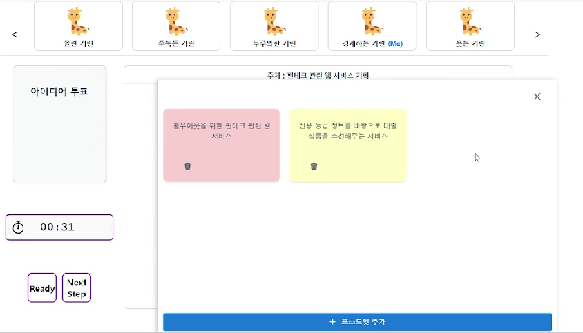
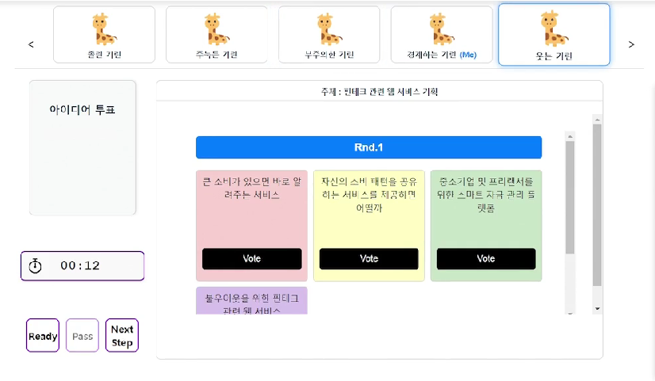
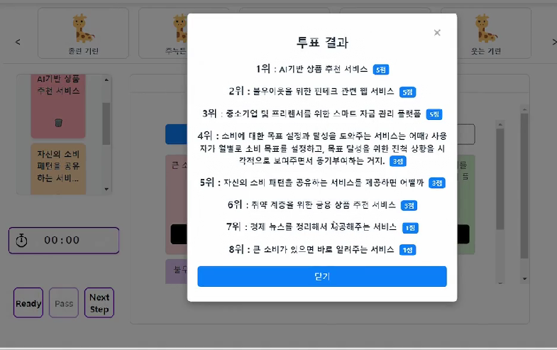
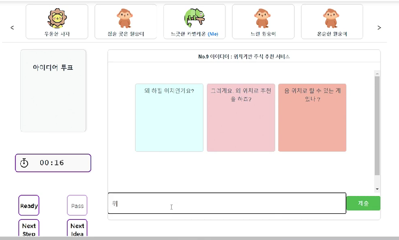

# 시연 시나리오

## 회의 주제에 대한 의견 정리

- 현재 토론 중인 주제에 대한 아이디어를 작성합니다.
- 의견을 작성하고 삭제할 수 있습니다.

## 회의 보드에 포스트잇 내용 추가

- 작성한 아이디어를 자기 차례에 제출합니다.
- 다른 사람이 작성한 아이디어를 볼 수 있습니다.

## 포스트잇 내용에 대한 투표

- 아이디어 작성이 끝나면 마음에 드는 아이디어에 대해서 투표합니다.
- 투표한 내용의 순위를 확인할 수 있습니다.

## 상위 투표 결과에 대한 코멘트 입력 

- 결정된 아이디어에 대하여 자신의 생각을 제출합니다.
- 제출한 내용은 다른 사람들에게 공유됩니다.

## 회의 산출물 확인 및 화상 회의 진행

- 회의가 종료되면 회의 산출물을 확인할 수 있습니다.
- 회의를 종료하거나 산출물에 대한 화상 회의를 진행할 수 있습니다.
