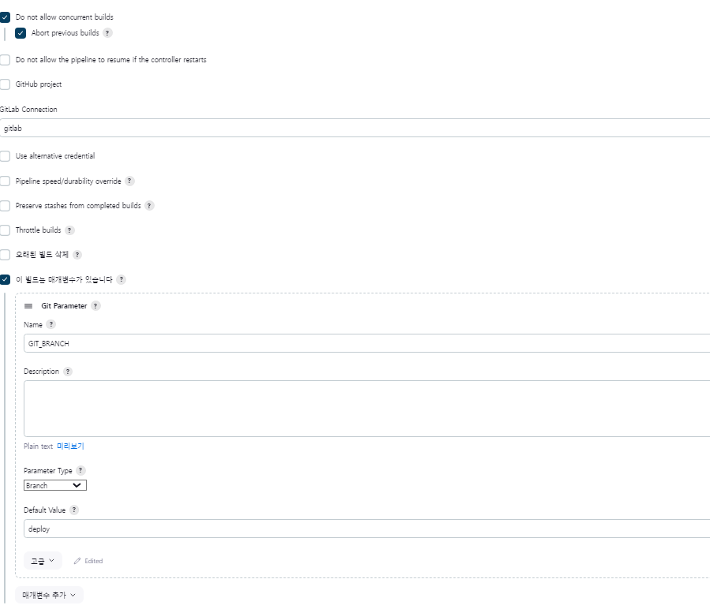
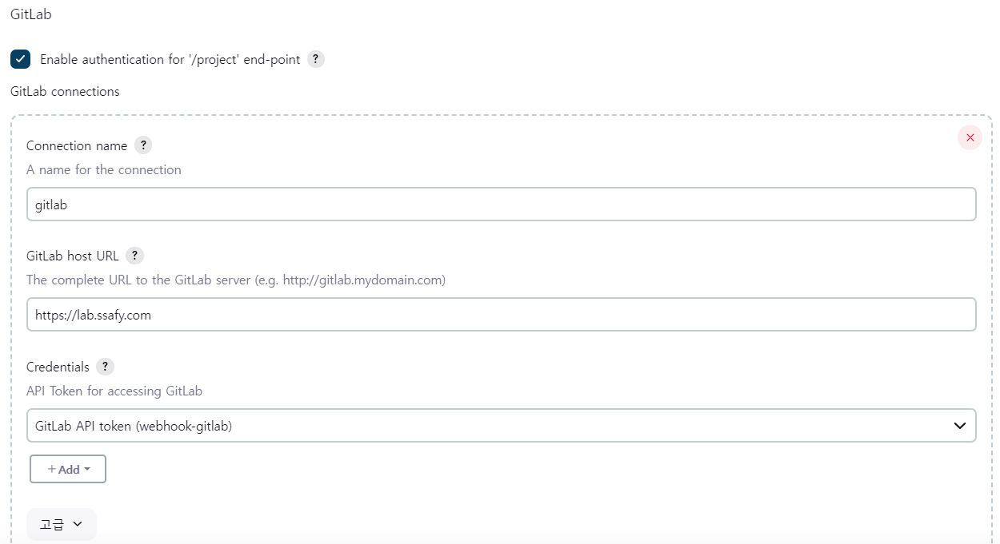
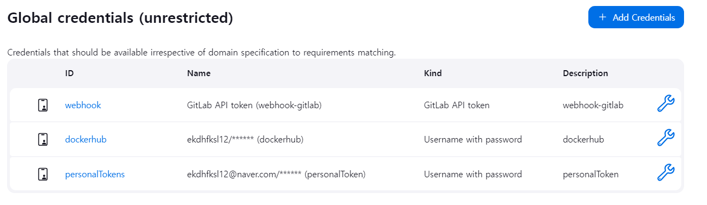
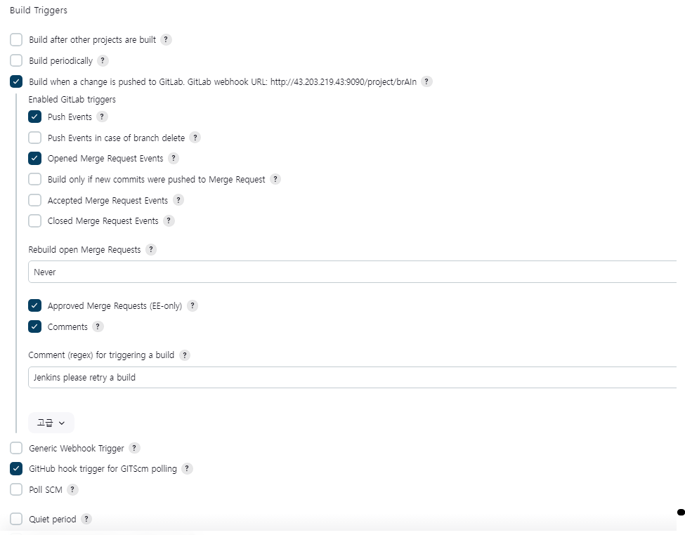
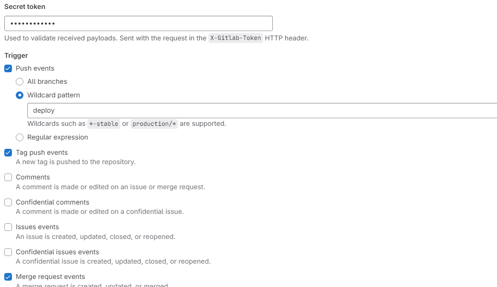

## Docker 설치

### Docker 설치 준비
```plaintext
sudo apt-get update
sudo apt-get upgrade
sudo apt-get install apt-transport-https ca-certificates curl software-properties-common
```

### Docker GPG 키 추가
```plaintext
curl -fsSL https://download.docker.com/linux/ubuntu/gpg | sudo gpg --dearmor -o /usr/share/keyrings/docker-archive-keyring.gpg
```

### Docker 저장소 설정
```plaintext
echo "deb [arch=amd64 signed-by=/usr/share/keyrings/docker-archive-keyring.gpg] https://download.docker.com/linux/ubuntu $(lsb_release -cs) stable" | sudo tee /etc/apt/sources.list.d/docker.list > /dev/null
```

### Docker 설치
```plaintext
sudo apt-get update
sudo apt-get install docker-ce docker-ce-cli containerd.io
docker --version // 도커 버전 확인
```

### Docker 권한 설정 && 서비스 확인
```plaintext
sudo usermod -aG docker $USER
sudo systemctil status docker
```

---

## Jenkins 설치 

### 시스템 업데이트 및 자바 설치
```plaintext
sudo apt-get update
sudo apt-get upgrade
sudo apt-get install openjdk-17-jdk
```

### Jenkins 저장소 추가
```plaintext
echo deb [signed-by=/usr/share/keyrings/jenkins-keyring.asc] \
https://pkg.jenkins.io/debian-stable binary/ | sudo tee \
/etc/apt/sources.list.d/jenkins.list > /dev/null
sudo apt-get update
sudo apt-get install jenkins

```

### 설치 및 방화벽 설정
```plaintext
sudo systemctl start jenkins
sudo systemctl enable jenkins
sudo ufw allow portNumber(사용하는 포트번호)
sudo ufw status
sudo cat /var/lib/jenkins/secrets/initialAdminPassword //초기 관리자 비밀번호 확인 +(플러그인 설치)
```

---


## Nginx 설치

### 설치 및 서비스 관리
```plaintext
sudo apt-get install nginx
sudo systemctl status nginx //상태 확인
sudo systemctl start nginx
sudo systemctl enable nginx //자동 시작 설정
sudo ufw allow 'Nginx HTTPS' //방화박 셜정
sudo nano /etc/nginx/nginx.conf //필요에 따른 설정 파일 수정
```

---

## Openvidu 설치

### docker 및 docker compose 설치
```plaintext
sudo apt-get install -y docker.io
sudo curl -L "https://github.com/docker/compose/releases/download/v2.0.1/docker-compose-$(uname -s)-$(uname -m)" -o /usr/local/bin/docker-compose
sudo chmod +x /usr/local/bin/docker-compose
```

### openvidu 다운로드
```plaintext
wget https://s3-eu-west-1.amazonaws.com/aws.openvidu.io/install_openvidu_latest.sh -O openvidu_install.sh
chmod +x openvidu_install.sh
./openvidu_install.sh //설정 파일 생성
./openvidu up //openvidu 서버 실행 
```

---


## Rabbitmq 설치

### Erlang 저장소 추가
```plaintext
echo "deb https://packages.erlang-solutions.com/ubuntu $(lsb_release -sc) contrib" | sudo tee /etc/apt/sources.list.d/erlang.list
```

### GPG 키 추가 및 Erlang 설치
```plaintext
wget https://packages.erlang-solutions.com/ubuntu/erlang_solutions.asc
sudo apt-key add erlang_solutions.asc
sudo apt-get update
sudo apt-get install erlang
```

### RabbitMQ 저장소 추가
```plaintext
echo "deb https://dl.bintray.com/rabbitmq-erlang/debian $(lsb_release -sc) erlang" | sudo tee /etc/apt/sources.list.d/bintray.rabbitmq.list
wget -O- https://www.rabbitmq.com/rabbitmq-release-signing-key.asc | sudo apt-key add -
```

### RabbitMQ 설치
```plaintext
sudo apt-get update
sudo apt-get install rabbitmq-server
sudo rabbitmq-plugins enable rabbitmq_management //관리 플러그인 활성화
```

---

## Database 설치

### MariaDB

```plaintext
sudo apt-get install mariadb-server
sudo systemctl status mariadb
sudo systemctl enable mariadb //서비스 자동 시작 설정
sudo ufw allow 3306/tcp //필요에 따른 방화벽 설정
```

### Redis
```plaintext
sudo apt-get install redis-server
sudo systemctl status redis-server
sudo nano /etc/redis/redis.conf //설정 파일 편집
```

---

## CI/CD

### Jenkins Pipeline 관리

**gitlab 연결 **



**jenkins 에서 gitlab webook 설정**




**credentials 설정**



**build trigger 설정**



** gitlab webhook**


